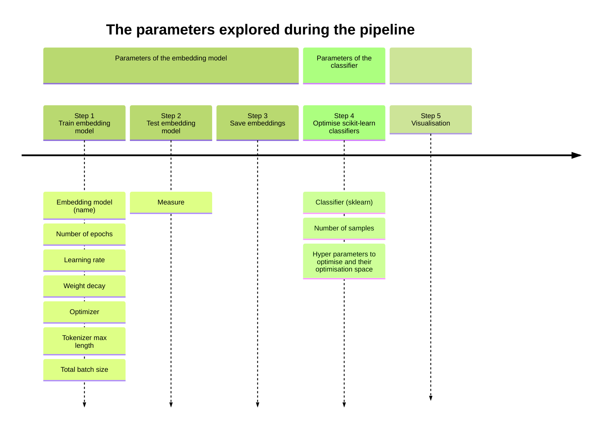

# Text Classification: exploring hyper parameters and classifying techniques

## TLDR

- **🎯 Goal:** Exploring the impact of hyperparameter tuning and classifying techniques on text classification performances. 
- **🗂️ Framework:** The classification tasks were chosen to fit in the CSS[^1] context. The tasks were gatheres by [Ziems et al. (2024)](https://direct.mit.edu/coli/article/50/1/237/118498/Can-Large-Language-Models-Transform-Computational).
- **⚙️ How:** Proposing a pipeline allowing users to choose a set of parameters to test and visualise the results for further analysis. The pipeline uses state of the art libraries such as 🤗 Hugging Face transformers, PyTorch and Scikit-learn.
- **💻 Setup:** The repository contains an `environment.yml` file for easy setup. The pipeline can be run on CPU or (single) GPU.

## Setting up the environment 

## Parameters tested


## Libraries used

## 

## The pipeline


## The architecture


[^1]: Computational Social Science.
# active-tigger-model-dev
This repository is used to develop models to be used in [active tigger](https://github.com/emilienschultz/activetigger)

# Env
```bash
conda create -n VENV python=3.11
pip install -q transformers datasets
conda install pytorch
pip install 'accelerate>=0.26.0'
conda install s3fs
conda install scikit-learn
pip install mergedeep
conda install plotly
pip install -U kaleido
pip install pygad
conda install great_tables
```
Si sur GPU : 
```
pip install -U flash_attn
```

CAREFUL, this is not running properly on some GPUs — only god knows why.
