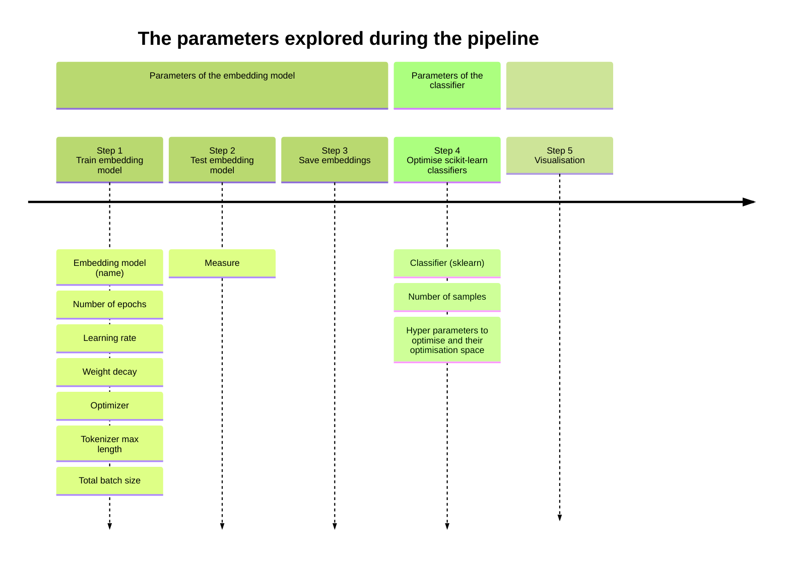

# Text Classification: exploring hyper parameters and classifying techniques

## TLDR

- **🎯 Goal:** Exploring the impact of hyperparameter tuning and classifying techniques on text classification performances. 
- **🗂️ Framework:** The classification tasks were chosen to fit in the CSS[^1] context. The tasks were gatheres by [Ziems et al. (2024)](https://direct.mit.edu/coli/article/50/1/237/118498/Can-Large-Language-Models-Transform-Computational).
- **⚙️ How:** Proposing a pipeline allowing users to choose a set of parameters to test and visualise the results for further analysis. The pipeline uses state of the art libraries such as 🤗 Hugging Face transformers, PyTorch and Scikit-learn.
- **💻 Setup:** The repository contains an `environment.yml` file for easy setup. The pipeline can be run on CPU or (single) GPU.

## Setting up the environment 

To set up the environment, use the `requirements.yml` file as such : 

```bash
conda env create -f requirements.yml -n ENV_NAME
```

Alternatively, you can create the environment manually by typing : 

```bash
conda create -n ENV_NAME python=3.11
conda activate ENV_NAME
pip install -qU 'transformers==4.52.4' 'datasets==3.6.0' 'accelerate==1.8.1' 'mergedeep==1.3.4' 'pygad==3.4.0' 'kaleido==1.0.0' 'great-tables==0.17.0' 'selenium==4.33.0'
conda install 'pytorch==2.7.1' 'scikit-learn==1.7.0' 'plotly==6.1.2' 'pandas==2.3.0'
```

And if you use GPUs:

```bash
pip install flash-attn==2.7.3 --no-build-isolation
```

## Libraries used

- [Pandas](https://pandas.pydata.org/docs/), [Numpy](https://numpy.org/doc/2.3/) and [Scipy](https://docs.scipy.org/doc/scipy/): Used for common data management and statistic calculus.
- [🤗 Hugging Face - transformers and datasets](https://huggingface.co/docs): This library is used to load data and train the embedding model.
- [Scikit-learn](https://scikit-learn.org/stable/): Used to load, train and test classifiers used on embeddings.
- [Pygad](https://pygad.readthedocs.io/en/latest/): Used to optimise the hyperparameters of the Scikit-learn classifiers.

## Parameters tested




## 

## The pipeline


## The data architecture

```
> ./
    > 📔 data
        > Your choice
    
    > 💻 src
        > toolbox
            > All classes and functions
        > Example of routines

    > 🚀 models
        > model name prefix (FacebookAI)
            > model name suffix (roberta-base)
                > iteration (001)
                > ...
            > ...
        > ...

    > 📋 results
        > ... Your choice
    
    > 📖 pers_logs
        > ... Your choice
    
    > 📊 figures
        > ... Your choice
```


[^1]: Computational Social Science.